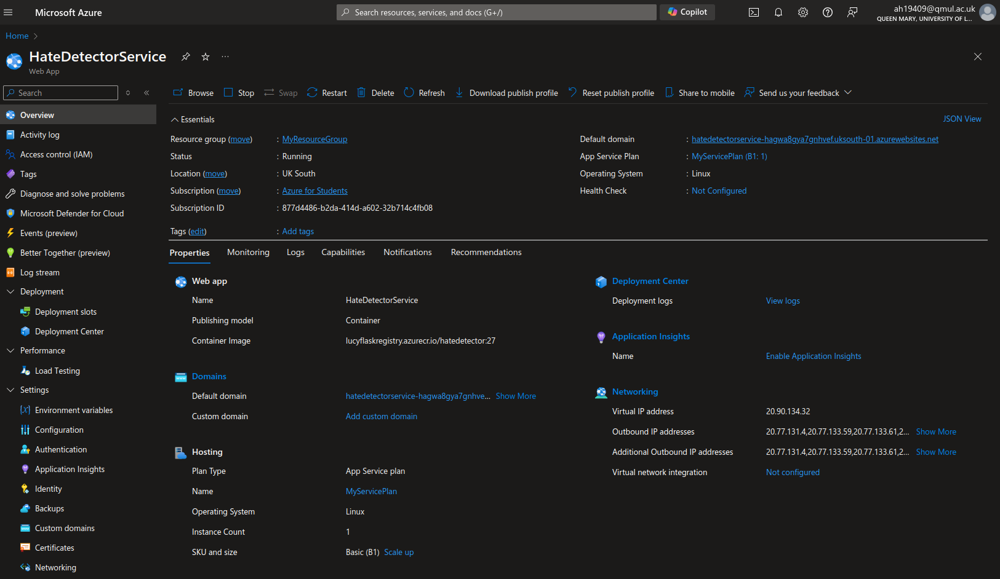

# Hate Speech Detection with xLSTM

This project utilizes an advanced xLSTM model to detect hate speech in text data. The xLSTM model extends the capabilities of traditional LSTM networks by incorporating advanced gating mechanisms, attention mechanisms, and hierarchical structures, allowing it to better handle long-term dependencies and complex patterns in textual data. This project aims to improve the accuracy and robustness of hate speech detection systems.


https://arxiv.org/pdf/2405.04517

## Features

- **Enhanced Contextual Understanding**: The xLSTM model retains and utilizes context over extended sequences, which is crucial for detecting hate speech.
- **Improved Handling of Long-Term Dependencies**: The model captures long-term dependencies within the text, improving pattern recognition for hate speech.
- **Attention Mechanisms**: The model can focus on specific parts of the input sequence that are more relevant, enhancing its ability to distinguish between benign and harmful content.
- **Hierarchical Structures**: The model understands language at multiple levels of granularity, which is vital for nuanced text analysis.

## Theoretical Background

The xLSTM model, introduced in recent research, extends the capabilities of traditional LSTM networks. By incorporating advanced gating mechanisms, such as multiple forget gates and input gates, as well as attention mechanisms and hierarchical structures, xLSTM can better capture long-term dependencies and complex patterns in text data. This enhanced capability makes xLSTM particularly suitable for tasks like hate speech detection, where understanding context over extended sequences is crucial.

## Model Structure and Architecture

The xLSTM model is composed of several interconnected components:

- **xLSTM Block Stack**: Contains multiple blocks (mLSTMBlock or sLSTMBlock) that capture different aspects of the input sequence.
- **Post Blocks Normalization**: A layer normalization applied after processing through the stack of blocks.
- **Token Embedding**: Converts input tokens into continuous embeddings.
- **Final Linear Layers**: Projects the embeddings to output logits for binary classification.

### Key Components and Their Functions

1. **xLSTM Block Stack**: The core computational unit of the model.
   - **mLSTMBlock**: Includes layer normalization, projection layers, headwise linear expansions, causal convolutions, activation functions, mLSTMCell, and dropout.
   - **sLSTMBlock**: Similar to mLSTMBlock but uses a simplified LSTM cell and includes a Gated Feedforward Network (FFN).

2. **Post Blocks Normalization**: Stabilizes the output before passing it to the final linear layers.

3. **Token Embedding**: Maps discrete input tokens to continuous vectors of size 64, capturing semantic information.

4. **Final Linear Layers**: 
   - **Linear Layer (lm_head)**: Projects the embeddings to the output vocabulary size.
   - **Fully Connected Layer (fc)**: Reduces the dimensionality to a single output for binary classification.
   - **Dropout**: Applied to prevent overfitting.

## Training Procedure

1. **Pre-training for Next Token Prediction**: The model is pre-trained on a large corpus of text to predict the next word in a sequence, learning general language patterns, grammar, and semantics.

2. **Fine-tuning for Hate Speech Detection**: The pre-trained model is further trained on a labeled dataset of hate and non-hate tweets to optimize its performance for binary classification.

## Potential Benefits and Applications

- **Efficiency in Handling Large Data**: The model's design can handle large input dimensions efficiently, making it suitable for tasks involving long sequences or high-dimensional data.
- **Stable Training**: The use of multi-head layer normalization and causal convolutions can lead to more stable training by preventing gradient issues often encountered in deep RNNs.
- **Memory Efficiency**: The model is designed to be memory efficient, crucial when working with large datasets or long sequences.
- **Flexibility**: The combination of mLSTM and sLSTM blocks provides a flexible architecture that can adapt to different types of sequential data, making it suitable for a wide range of applications such as natural language processing, time-series forecasting, and more.

## How to test the Application on local machine

1. **Set Environment Variables**:
   - `PORT`: Port on which the Flask app will run (default: 8000).
   - `DEBUG_MODE`: Set to `True` to enable debug mode (default: `False`).
   - `MODEL_PATH`: Path to the pre-trained model file (default: `./Models/model1_bin_final.pth`).
   - `SCALER_PATH`: Path to the scaler file (default: `fitted_scaler.joblib`).

2. **Build and Run the Docker Container**:
   - Build the Docker image: 
     ```sh
     docker build -t myflaskapp .
     ```
   - Run the Docker container: 
     ```sh
     docker run -p 8000:8000 myflaskapp
     ```

3. **Access the Application**:
   - Open a web browser and navigate to `http://localhost:8000` to access the app.

## References

- [Applicat+ion GitHub Model Repository](https://github.com/LucyNowacki/xLSTM-Hate-Tweets-Detector)
- [xLSTM GitHub Repository](https://github.com/NX-AI/xlstm)
- Wang et al. (2023). *Advanced LSTM Networks for Sequential Data Modeling*.


## DEPLOYEMENT

# Deployment Process for HateDetectorService

This guide outlines the steps to deploy the `HateDetectorService` on Azure using Docker and Azure Web App for Containers.

### Step 1: Setup the Project Locally

#### 1. Create and Prepare Docker Image

- Develop your application locally.
- Create a Dockerfile (e.g., `MyDockerfile.dockerfile`) to containerize your application.
- Build the Docker image locally using the following command:

    ```sh
    docker build -t your-image-name:tag -f MyDockerfile.dockerfile .
    ```

    Example:

    ```sh
    docker build -t lucynowacki/hatedetector:27 -f MyDockerfile.dockerfile .
    ```

### Step 2: Push the Docker Image to Azure Container Registry (ACR)

#### 1. Tag the Docker Image for ACR

- Tag the Docker image for the Azure Container Registry:

    ```sh
    docker tag your-image-name:tag your-registry-name.azurecr.io/your-image-name:tag
    ```

    Example:

    ```sh
    docker tag lucynowacki/hatedetector:27 lucyflaskregistry.azurecr.io/hatedetector:27
    ```

#### 2. Push the Docker Image to ACR

- Push the tagged Docker image to your Azure Container Registry:

    ```sh
    docker push your-registry-name.azurecr.io/your-image-name:tag
    ```

    Example:

    ```sh
    docker push lucyflaskregistry.azurecr.io/hatedetector:27
    ```

### Step 3: Deploy the Docker Image to Azure Web App

#### 1. Configure Web App to Use the Container Image

- Set the container image for your Azure Web App:

    ```sh
    az webapp config container set \
    --name <Your-Web-App-Name> \
    --resource-group <Your-Resource-Group> \
    --docker-custom-image-name <ACR_LOGIN_SERVER>/hatedetector:latest \
    --docker-registry-server-url https://<ACR_LOGIN_SERVER>
    ```

    Example:

    ```sh
    az webapp config container set \
    --name hatedetectorservice \
    --resource-group MyResourceGroup \
    --docker-custom-image-name lucyflaskregistry.azurecr.io/hatedetector:27 \
    --docker-registry-server-url https://lucyflaskregistry.azurecr.io
    ```

#### 2. Set ACR Credentials

- Set the ACR credentials in your Web App configuration:

    ```sh
    az webapp config appsettings set \
    --name <Your-Web-App-Name> \
    --resource-group <Your-Resource-Group> \
    --settings DOCKER_REGISTRY_SERVER_URL=https://<ACR_LOGIN_SERVER> \
    DOCKER_REGISTRY_SERVER_USERNAME=<ACR_USERNAME> \
    DOCKER_REGISTRY_SERVER_PASSWORD=<ACR_PASSWORD>
    ```

    Example:

    ```sh
    az webapp config appsettings set \
    --name hatedetectorservice \
    --resource-group MyResourceGroup \
    --settings DOCKER_REGISTRY_SERVER_URL=https://lucyflaskregistry.azurecr.io \
    DOCKER_REGISTRY_SERVER_USERNAME=lucyflaskregistry \
    DOCKER_REGISTRY_SERVER_PASSWORD=<ACR_PASSWORD>
    ```

#### 3. Restart the Web App

- Restart the Azure Web App to apply the changes:

    ```sh
    az webapp restart --name <Your-Web-App-Name> --resource-group <Your-Resource-Group>
    ```

    Example:

    ```sh
    az webapp restart --name hatedetectorservice --resource-group MyResourceGroup
    ```

### Step 4: Access the Deployed Application

- Open a web browser and navigate to your Web App's URL to access the deployed application.

### Example of Azure App configuartion



### Troubleshooting

- If the application takes too long to respond or fails to start, ensure that all environment variables are correctly set and that the image has been successfully pulled from ACR.


